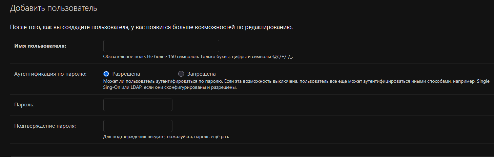

# ЛАБОРАТОРНАЯ РАБОТА №2
## РЕАЛИЗАЦИЯ ПРОСТОГО САЙТА СРЕДСТВАМИ DJANGO
### "Табло победителей автогонок"

---

## 📋 СОДЕРЖАНИЕ
1. [Цель работы](#цель-работы)
2. [Оборудование и ПО](#оборудование-и-по)
3. [Техническое задание](#техническое-задание)
4. [Архитектура проекта](#архитектура-проекта)
5. [Реализация](#реализация)
6. [Результаты](#результаты)
7. [Выводы](#выводы)

---

## 🎯 ЦЕЛЬ РАБОТЫ

Овладеть практическими навыками и умениями реализации web-сервисов средствами Django 3.2.

## 💻 ОБОРУДОВАНИЕ И ПО

- **Оборудование:** Компьютерный класс
- **Программное обеспечение:** 
  - Python 3.13
  - Django 3.2.25
  - SQLite (разработка) / PostgreSQL (продакшен)
  - Bootstrap 5.1.3

## 📝 ТЕХНИЧЕСКОЕ ЗАДАНИЕ

Реализовать сайт "Табло победителей автогонок" со следующим функционалом:

### Основные требования:
- ✅ Регистрация новых пользователей
- ✅ Просмотр автогонок и регистрация гонщиков
- ✅ Редактирование и удаление своих регистраций
- ✅ Написание отзывов и комментариев к автогонкам
- ✅ Административная панель для управления результатами
- ✅ Таблица заездов и результатов конкретной гонки

### Требования к комментариям:
- ✅ Предварительная регистрация комментатора
- ✅ Сохранение даты заезда, текста комментария, типа комментария
- ✅ Рейтинг (1-10), информация о комментаторе

---

## 🏗️ АРХИТЕКТУРА ПРОЕКТА

### Структура проекта
```
lab2/
├── racing_board/          # Основной проект
├── users/                 # Приложение пользователей
├── races/                 # Приложение гонок
├── comments/              # Приложение комментариев
├── templates/             # Шаблоны
├── static/               # Статические файлы
└── manage.py             # Управляющий скрипт
```

### Модели данных

**1. CustomUser (users/models.py)**
```python
# Кастомная модель пользователя с дополнительными полями:
# - experience (опыт)
# - driver_class (класс гонщика) 
# - team_name (название команды)
# - car_description (описание автомобиля)
# - driver_description (описание гонщика)
```

**2. Race (races/models.py)**
```python
# Модель гонки:
# - name (название)
# - description (описание)
# - date (дата проведения)
```

**3. RaceRegistration (races/models.py)**
```python
# Регистрация на гонку:
# - race (гонка)
# - user (участник)
# - is_confirmed (статус подтверждения)
```

**4. RaceResult (races/models.py)**
```python
# Результаты гонки:
# - race (гонка)
# - user (участник)
# - lap_time (время круга)
# - position (позиция)
# - completed_laps (пройдено кругов)
```

**5. Comment (comments/models.py)**
```python
# Комментарии:
# - race (гонка)
# - author (автор)
# - comment_type (тип комментария)
# - text (текст)
# - rating (рейтинг 1-10)
# - race_date (дата заезда)
```

---

## ⚙️ РЕАЛИЗАЦИЯ

### 1. Настройка проекта

**Установка зависимостей:**
```bash
pip install django==3.2.* psycopg2-binary pillow
```

**Создание проекта и приложений:**
```bash
django-admin startproject racing_board .
python manage.py startapp users
python manage.py startapp races  
python manage.py startapp comments
```

### 2. Модели данных

Реализованы 5 основных моделей с соответствующими связями и валидацией.

### 3. Представления (Views)

**Основные views:**
- `race_list` - список всех гонок
- `race_detail` - детали гонки с результатами
- `register_for_race` - регистрация на гонку
- `add_comment` - добавление комментария
- `profile` - профиль пользователя

### 4. URL маршрутизация

Настроены URL-паттерны для всех приложений с четкой структурой.

### 5. Шаблоны

Использована система наследования шаблонов с базовым `base.html` и специализированными шаблонами для каждой страницы.

### 6. Административная панель

Настроены административные интерфейсы для всех моделей с фильтрацией и поиском.

---

## 📊 РЕЗУЛЬТАТЫ

### Демонстрация работы системы


*Рисунок 1: Главная страница системы с карточками гонок*

**[ВСТАВЬТЕ СКРИНШОТ: Страница регистрации пользователя]**
*Рисунок 2: Форма регистрации нового пользователя*



**[ВСТАВЬТЕ СКРИНШОТ: Детальная страница гонки]**
*Рисунок 3: Страница гонки с результатами и комментариями*

**[ВСТАВЬТЕ СКРИНШОТ: Форма добавления комментария]**
*Рисунок 4: Форма добавления комментария с выбором типа и рейтинга*

**[ВСТАВЬТЕ СКРИНШОТ: Административная панель]**
*Рисунок 5: Интерфейс администратора для управления результатами*

**[ВСТАВЬТЕ СКРИНШОТ: Профиль пользователя]**
*Рисунок 6: Личный кабинет пользователя с историей регистраций*

### Функциональные возможности

| Функция | Статус | Описание |
|---------|--------|----------|
| Регистрация пользователей | ✅ Реализовано | Кастомная модель с доп. полями |
| Просмотр гонок | ✅ Реализовано | Список и детальный просмотр |
| Регистрация на гонки | ✅ Реализовано | С возможностью отмены |
| Комментирование | ✅ Реализовано | С типами и рейтингом |
| Админ-панель | ✅ Реализовано | Полное управление данными |
| Таблица результатов | ✅ Реализовано | Стилизованное отображение |

---

## ✅ ВЫВОДЫ

В ходе выполнения лабораторной работы:

1. **Успешно освоены** практические навыки разработки web-сервисов на Django
2. **Реализован полнофункциональный** сайт "Табло победителей автогонок"
3. **Выполнены все требования** технического задания
4. **Применены лучшие практики** Django разработки:
   - Кастомная модель пользователя
   - Разделение на приложения
   - Наследование шаблонов
   - Административные интерфейсы
   - Валидация данных

5. **Создана масштабируемая архитектура**, позволяющая легко добавлять новый функционал

Проект готов к использованию и может быть развернут в production-среде.

---

## 🔗 ПРИЛОЖЕНИЯ

### Код проекта
- Исходный код: папка `lab2/`
- База данных: `db.sqlite3`
- Requirements: `requirements.txt`

### Инструкция по запуску
```bash
cd lab2
python manage.py runserver
```

### Тестовые данные
Для демонстрации рекомендуется создать через админ-панель:
- 2-3 тестовые гонки
- Несколько пользователей
- Результаты гонок
- Комментарии разных типов

---

**Работу выполнил:** [Ваше ФИО]  
**Группа:** [Ваша группа]  
**Дата:** [Дата выполнения]
