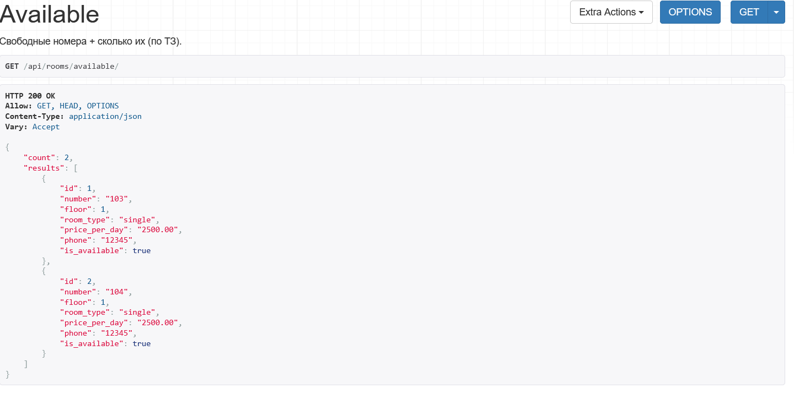
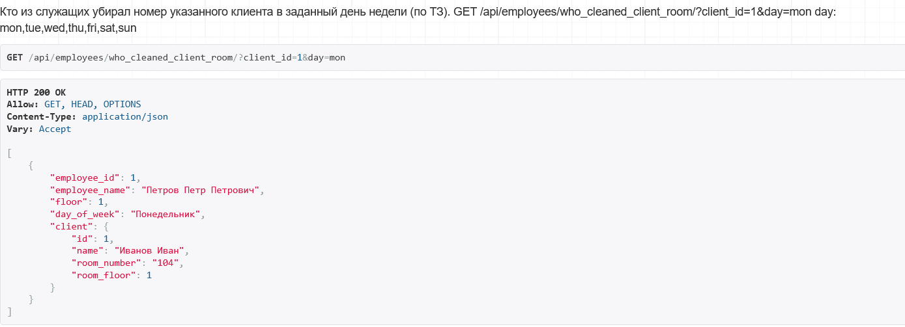
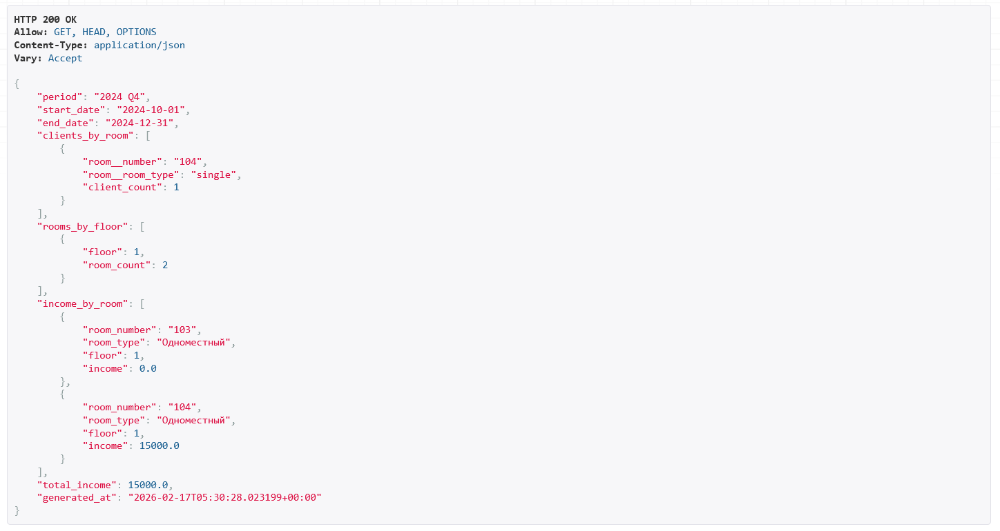

# РЕАЛИЗАЦИЯ СЕРВЕРНОЙ ЧАСТИ ПРИЛОЖЕНИЯ

## средствами Django и Django REST Framework

------------------------------------------------------------------------

## Задание

Реализовать программную систему для администратора гостиницы с
использованием:

-   Django
-   Django REST Framework
-   Djoser
-   PostgreSQL (или SQLite в режиме разработки)

Необходимо:

-   Реализовать модель базы данных средствами Django ORM
-   Реализовать REST API средствами DRF
-   Подключить регистрацию и авторизацию по токенам
-   Реализовать формирование отчёта за квартал

------------------------------------------------------------------------

# Ход выполнения

## Модели данных

В рамках лабораторной работы реализована серверная часть системы для
администратора гостиницы.

### Room (Номер)

-   номер комнаты
-   этаж
-   тип номера (single / double / triple)
-   цена за сутки
-   телефон
-   статус доступности

### Client (Клиент)

-   паспорт
-   ФИО
-   город проживания
-   дата заселения
-   дата выселения
-   выделенный номер

### Employee (Сотрудник)

-   ФИО
-   статус (работает / уволен)
-   связь с учетной записью пользователя

### CleaningSchedule (График уборки)

-   сотрудник
-   этаж
-   день недели

------------------------------------------------------------------------

# Реализация API через Django REST Framework

Для каждой модели был создан ModelViewSet.

``` python
class RoomViewSet(ModelViewSet):
    queryset = Room.objects.all()
    serializer_class = RoomSerializer
```

``` python
class RoomSerializer(serializers.ModelSerializer):
    class Meta:
        model = Room
        fields = '__all__'
```

------------------------------------------------------------------------

# Маршрутизация

``` python
router.register(r'rooms', RoomViewSet)
router.register(r'clients', ClientViewSet)
router.register(r'employees', EmployeeViewSet)
router.register(r'cleaning', CleaningScheduleViewSet)
```

Основные endpoints:

-   /api/rooms/
-   /api/clients/
-   /api/employees/
-   /api/cleaning/
-   /api/report/
-   /api/statistics/hotel/
-   /api/statistics/clients/

------------------------------------------------------------------------

# Реализованные API-запросы

## 1. Получение списка номеров

GET /api/rooms/

### Ответ сервера:


------------------------------------------------------------------------

## 2. Заселение клиента

POST /api/clients/

### Ответ сервера:


------------------------------------------------------------------------

## 3. Выселение клиента

POST /api/clients/{id}/check_out/


------------------------------------------------------------------------

## 4. Свободные номера

GET /api/rooms/available/

### Ответ сервера:



------------------------------------------------------------------------

## 5. Клиенты из города

GET /api/clients/from_city/?city=Москва

### Ответ сервера:


------------------------------------------------------------------------

## 6. Клиенты в номере за период

POST /api/rooms/clients_in_period/


------------------------------------------------------------------------

## 7. Кто убирал номер клиента

GET /api/employees/who_cleaned_client_room/?client_id=1&day=mon

### Ответ:



------------------------------------------------------------------------

## 8. Отчет за квартал

GET /api/report/?quarter=4&year=2024

### Ответ сервера:



------------------------------------------------------------------------

# Авторизация и регистрация (Djoser)

## Получение токена

POST /auth/token/login/

### Ответ:


------------------------------------------------------------------------

# Панель администратора


------------------------------------------------------------------------

# Вывод

В ходе лабораторной работы была реализована серверная часть системы для
администратора гостиницы на базе Django, Django REST Framework и Djoser.

Реализованы:

-   модели базы данных
-   REST API
-   сериализация данных
-   токенная авторизация
-   формирование отчета
-   административная панель

Проект демонстрирует уверенное владение Django ORM и инструментами
Django REST Framework.
