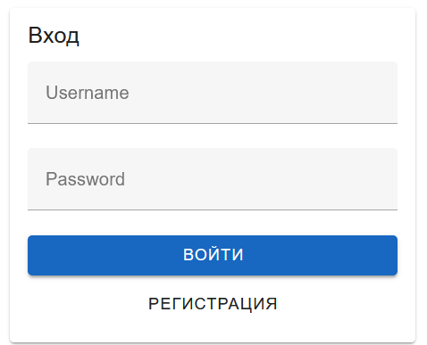
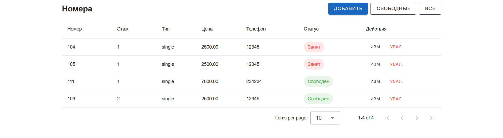

# Реализация клиентской части системы управления гостиницей средствами Vue.js

## Задание

Разработать современное клиентское приложение для системы управления
гостиницей на основе Vue.js, обеспечив:

-   удобный интерфейс управления номерами, клиентами, сотрудниками и
    уборкой;
-   авторизацию и регистрацию пользователей;
-   корректное взаимодействие с REST API серверной части (Django REST
    Framework);
-   отображение статистики и отчётов;
-   разграничение доступа пользователей.

В качестве UI-фреймворка использован Vuetify 3.

------------------------------------------------------------------------

# Ход выполнения

## 1. Создание проекта

``` bash
npm create vue@latest frontend
cd frontend
npm install
npm install vuetify axios vue-router
```

------------------------------------------------------------------------

## 2. Настройка взаимодействия с API

Создан HTTP-клиент:

``` js
const http = axios.create({
  baseURL: "http://127.0.0.1:8000",
})

http.interceptors.request.use((config) => {
  const token = localStorage.getItem("auth_token")
  if (token) {
    config.headers.Authorization = `Token ${token}`
  }
  return config
})
```

------------------------------------------------------------------------

## 3. Авторизация

Авторизация через:

POST /auth/token/login/

Токен сохраняется в localStorage и используется для дальнейших запросов.



------------------------------------------------------------------------

## 4. Интерфейс "Номера"

Функционал:

-   просмотр номеров
-   добавление
-   редактирование
-   удаление
-   фильтрация свободных



------------------------------------------------------------------------

## 5. Заселение и выселение

Выселение:

POST /api/clients/{id}/check_out/

Тело запроса:

{ "check_out_date": "2024-11-15" }

Интерфейс:


------------------------------------------------------------------------

## 6. Клиенты

-   создание клиента
-   заселение
-   выселение


------------------------------------------------------------------------

## 7. Сотрудники

-   просмотр
-   добавление
-   увольнение
-   приём


------------------------------------------------------------------------

## 8. Уборка

-   назначение уборки
-   отслеживание статуса


------------------------------------------------------------------------

## 9. Статистика и отчёты

Используемые endpoint:

GET /api/stats/ GET /api/stats_client/ GET /api/quarter_report/


------------------------------------------------------------------------

# Проблемы и решения

1.  Настроен django-cors-headers
2.  Добавлен axios interceptor
3.  Исправлены ошибки экспорта функций
4.  Исправлена ошибка CORS preflight
5.  Переработан layout App.vue

------------------------------------------------------------------------

# Вывод

Разработана полноценная SPA-система управления гостиницей на Vue.js +
Vuetify 3, с Django REST Framework.
