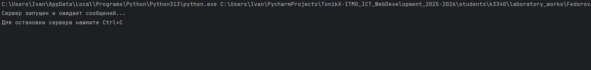

# Задача 1

## Цель

Реализовать клиентскую и серверную часть приложения с использованием библиотеки **socket** и протокола **UDP**.  
Клиент должен отправить серверу сообщение _«Hello, server»_, сервер выводит его у себя и отвечает _«Hello, client»_, которое отображается у клиента.

## Выполнение
В ходе выполнения были реализованы клиент и сервер, где:
- **Клиент** отправляет строку `"Hello, server!"` серверу по протоколу UDP.  
- **Сервер** принимает сообщение и выводит его в консоль.  
- В ответ сервер отправляет строку `"Hello, client!"`, которая отображается в консоли у клиента.  


### Клиент

```python
import socket


def run_client():
    try:
        sock_client = socket.socket(socket.AF_INET, socket.SOCK_DGRAM)

        # Отправляем сообщение серверу
        message = 'Hello, server'
        server_address = ("localhost", 8080)

        print(f"Отправка сообщения серверу: {message}")
        sock_client.sendto(message.encode('utf-8'), server_address)

        # Получаем ответ от сервера
        response, address = sock_client.recvfrom(1024)
        print(f'Server {address}: {response.decode("utf-8")}')

    except Exception as e:
        print(f"Ошибка клиента: {e}")
    finally:
        sock_client.close()


if __name__ == "__main__":
    run_client()
```

### Сервер

```python
import socket


def run_server():
    try:
        sock_server = socket.socket(socket.AF_INET, socket.SOCK_DGRAM)
        sock_server.bind(('localhost', 8080))

        print("Сервер запущен и ожидает сообщений...")
        print("Для остановки сервера нажмите Ctrl+C")

        while True:
            try:
                # Получаем данные от клиента
                request, address = sock_server.recvfrom(1024)
                decoded_message = request.decode('utf-8')
                print(f'Client {address}: {decoded_message}')

                # Отправляем ответ клиенту
                response = 'Hello, client'
                sock_server.sendto(response.encode('utf-8'), address)
                print(f"Ответ отправлен клиенту {address}")

            except Exception as e:
                print(f"Ошибка при обработке запроса: {e}")

    except KeyboardInterrupt:
        print("\nСервер остановлен")
    except Exception as e:
        print(f"Ошибка сервера: {e}")
    finally:
        sock_server.close()


if __name__ == "__main__":
    run_server()
```

## Результат

При запуске сервер ожидает сообщения.
На стороне клиента:

```
Hello, client!
```

На стороне сервера:

```
Hello, server!
```
Результаты работы после запуска обоих файлов:




## Вывод

Была успешно реализована простая клиент-серверная архитектура с использованием UDP-сокетов. Клиент отправляет сообщение серверу, сервер его принимает и отвечает клиенту.