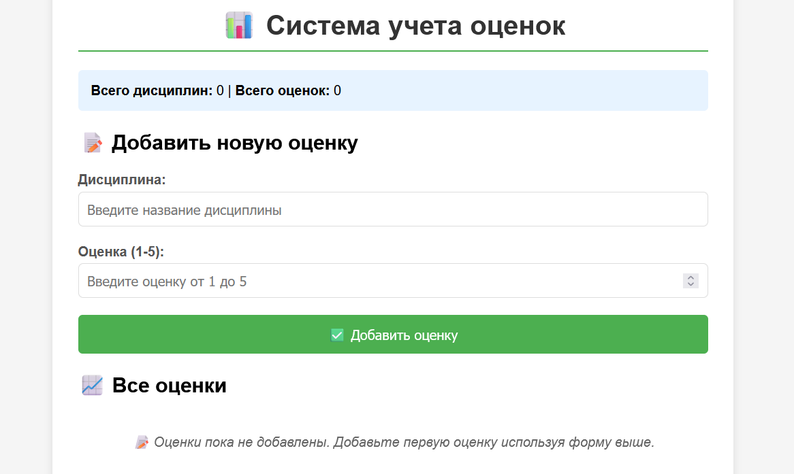

## Цель

Написать простой веб‑сервер для обработки **GET** и **POST** HTTP‑запросов с использованием библиотеки **socket**.  
Сервер должен уметь сохранять и отображать оценки по дисциплинам:

- через POST‑запрос добавляется дисциплина и оценка;
- через GET‑запрос отдаются все оценки в виде HTML‑страницы или JSON.

## Выполнение

Сервер реализован на базе TCP-сокетов с использованием многопоточности для обработки одновременных HTTP-запросов. Система предоставляет веб-интерфейс и RESTful API.
Функциональность сервера
Обработка HTTP-запросов

    Парсинг запросов: Анализ метода (GET/POST), пути и параметров запроса

    Поддержка методов: GET для получения данных, POST для добавления новых оценок

    Извлечение параметров: Обработка query-строки для GET и тела запроса для POST

**Управление данными оценок**

    Хранение: Словарь для сохранения оценок по дисциплинам

    Валидация: Проверка корректности вводимых оценок (целые числа от 1 до 5)

    Безопасность: Экранирование HTML-символов для предотвращения XSS-атак

**Маршрутизация endpoints**

    GET / - главная страница с интерфейсом управления

    POST /add - добавление новой оценки

    GET /api/grades - JSON API для получения всех оценок

**Генерация контента**

    Динамический HTML: Автоматическое формирование страниц с актуальными данными

    Статистика: Расчет среднего балла и количества оценок по каждой дисциплине

    Визуализация: Табличное представление данных с CSS-стилизацией

**Безопасность**

    Валидация входных данных на стороне сервера

    Экранирование пользовательского ввода

    Проверка диапазона оценок

**Пользовательский интерфейс**

    Адаптивный дизайн с CSS-стилизацией

    Интуитивная форма ввода данных

    Визуальная обратная связь при операциях

    Отображение статистики в реальном времени

**Тестирование**

Реализован тестовый клиент с использованием библиотеки requests, который проверяет:

    Доступность основных endpoints

    Корректность добавления оценок

    Работу JSON API

    Обработку ошибок

# Принцип работы

    Инициализация сервера: Создание TCP-сокета и переход в режим прослушивания

    Обработка подключений: Для каждого клиента создается отдельный поток

    Анализ запроса: Определение метода, пути и параметров HTTP-запроса

    Маршрутизация: Выбор соответствующего обработчика на основе пути

    Обработка данных: Валидация и сохранение оценок (для POST-запросов)

    Генерация ответа: Формирование HTTP-ответа с соответствующими заголовками и телом

    Отправка результата: Возврат HTML-страницы или JSON-данных клиенту

## Протокол взаимодействия

    Клиенты взаимодействуют с сервером через стандартные HTTP-запросы

    Для веб-интерфейса используется браузер

    Для автоматизированного тестирования применяется REST-клиент

    Данные передаются в формате application/x-www-form-urlencoded для форм и JSON для API


### Сервер

```python
import socket
import threading
from urllib.parse import parse_qs
import html
from datetime import datetime


class SimpleHTTPServer:
    def __init__(self, host='localhost', port=8080):
        self.host = host
        self.port = port
        self.grades = {}  # {discipline: [grade1, grade2, ...]}
        self.server_socket = None

    def parse_request(self, request_data):
        """Парсит HTTP запрос"""
        lines = request_data.split('\r\n')
        if not lines:
            return None, None, {}

        # Первая строка - метод и путь
        first_line = lines[0].split()
        if len(first_line) < 2:
            return None, None, {}

        method = first_line[0]
        path = first_line[1]

        # Парсим параметры
        params = {}
        if method == 'GET' and '?' in path:
            path, query_string = path.split('?', 1)
            params = parse_qs(query_string)
            # Убираем списки из значений
            params = {k: v[0] for k, v in params.items()}
        elif method == 'POST':
            # Ищем тело запроса
            body_start = request_data.find('\r\n\r\n') + 4
            if body_start > 3:
                body = request_data[body_start:]
                params = parse_qs(body)
                params = {k: v[0] for k, v in params.items()}

        return method, path, params

    def add_grade(self, discipline, grade):
        """Добавляет оценку по дисциплине"""
        discipline = html.escape(discipline.strip())
        try:
            grade = int(grade)
            if grade < 1 or grade > 5:
                return False, "Оценка должна быть от 1 до 5"
        except ValueError:
            return False, "Оценка должна быть числом"

        if discipline not in self.grades:
            self.grades[discipline] = []

        self.grades[discipline].append(grade)
        return True, "Оценка успешно добавлена"

    def generate_html(self, message=""):
        """Генерирует HTML страницу с оценками"""
        html_content = f"""
        <!DOCTYPE html>
        <html lang="ru">
        <head>
            <meta charset="UTF-8">
            <meta name="viewport" content="width=device-width, initial-scale=1.0">
            <title>Система учета оценок</title>
            <style>
                body {{
                    font-family: Arial, sans-serif;
                    max-width: 800px;
                    margin: 0 auto;
                    padding: 20px;
                    background-color: #f5f5f5;
                }}
                .container {{
                    background: white;
                    padding: 30px;
                    border-radius: 10px;
                    box-shadow: 0 2px 10px rgba(0,0,0,0.1);
                }}
                h1 {{
                    color: #333;
                    text-align: center;
                    border-bottom: 2px solid #4CAF50;
                    padding-bottom: 10px;
                }}
                .form-group {{
                    margin-bottom: 20px;
                }}
                label {{
                    display: block;
                    margin-bottom: 5px;
                    font-weight: bold;
                    color: #555;
                }}
                input[type="text"], input[type="number"] {{
                    width: 100%;
                    padding: 10px;
                    border: 1px solid #ddd;
                    border-radius: 5px;
                    font-size: 16px;
                    box-sizing: border-box;
                }}
                button {{
                    background: #4CAF50;
                    color: white;
                    padding: 12px 24px;
                    border: none;
                    border-radius: 5px;
                    cursor: pointer;
                    font-size: 16px;
                    width: 100%;
                }}
                button:hover {{
                    background: #45a049;
                }}
                .message {{
                    padding: 10px;
                    margin: 10px 0;
                    border-radius: 5px;
                    text-align: center;
                }}
                .success {{
                    background: #d4edda;
                    color: #155724;
                    border: 1px solid #c3e6cb;
                }}
                .error {{
                    background: #f8d7da;
                    color: #721c24;
                    border: 1px solid #f5c6cb;
                }}
                .grades-table {{
                    width: 100%;
                    border-collapse: collapse;
                    margin-top: 20px;
                }}
                .grades-table th, .grades-table td {{
                    border: 1px solid #ddd;
                    padding: 12px;
                    text-align: left;
                }}
                .grades-table th {{
                    background: #f8f9fa;
                    font-weight: bold;
                }}
                .grades-table tr:nth-child(even) {{
                    background: #f2f2f2;
                }}
                .no-data {{
                    text-align: center;
                    color: #666;
                    font-style: italic;
                    padding: 20px;
                }}
                .stats {{
                    background: #e7f3ff;
                    padding: 15px;
                    border-radius: 5px;
                    margin: 15px 0;
                }}
            </style>
        </head>
        <body>
            <div class="container">
                <h1>📊 Система учета оценок</h1>

                <div class="stats">
                    <strong>Всего дисциплин:</strong> {len(self.grades)} | 
                    <strong>Всего оценок:</strong> {sum(len(grades) for grades in self.grades.values())}
                </div>

                <h2>📝 Добавить новую оценку</h2>
                <form method="POST" action="/add">
                    <div class="form-group">
                        <label for="discipline">Дисциплина:</label>
                        <input type="text" id="discipline" name="discipline" required 
                               placeholder="Введите название дисциплины">
                    </div>

                    <div class="form-group">
                        <label for="grade">Оценка (1-5):</label>
                        <input type="number" id="grade" name="grade" min="1" max="5" required 
                               placeholder="Введите оценку от 1 до 5">
                    </div>

                    <button type="submit">✅ Добавить оценку</button>
                </form>
        """

        # Добавляем сообщение, если есть
        if message:
            msg_class = "success" if "успешно" in message else "error"
            html_content += f'<div class="message {msg_class}">{message}</div>'

        # Добавляем таблицу с оценками
        html_content += """
                <h2>📈 Все оценки</h2>
        """

        if self.grades:
            html_content += """
                <table class="grades-table">
                    <thead>
                        <tr>
                            <th>Дисциплина</th>
                            <th>Оценки</th>
                            <th>Средний балл</th>
                            <th>Количество</th>
                        </tr>
                    </thead>
                    <tbody>
            """

            for discipline, grades in sorted(self.grades.items()):
                avg_grade = sum(grades) / len(grades)
                grades_str = ", ".join(map(str, grades))

                html_content += f"""
                        <tr>
                            <td><strong>{discipline}</strong></td>
                            <td>{grades_str}</td>
                            <td>{avg_grade:.2f}</td>
                            <td>{len(grades)}</td>
                        </tr>
                """

            html_content += """
                    </tbody>
                </table>
            """
        else:
            html_content += """
                <div class="no-data">
                    📝 Оценки пока не добавлены. Добавьте первую оценку используя форму выше.
                </div>
            """

        # Футер
        html_content += f"""
                <div style="margin-top: 30px; text-align: center; color: #666; font-size: 12px;">
                    Сервер запущен: {datetime.now().strftime('%Y-%m-%d %H:%M:%S')}
                </div>
            </div>
        </body>
        </html>
        """

        return html_content

    def create_response(self, status_code, content, content_type="text/html; charset=utf-8"):
        """Создает HTTP ответ"""
        status_messages = {
            200: "OK",
            201: "Created",
            400: "Bad Request",
            404: "Not Found",
            405: "Method Not Allowed"
        }

        response = [
            f"HTTP/1.1 {status_code} {status_messages.get(status_code, 'Unknown')}",
            f"Content-Type: {content_type}",
            f"Content-Length: {len(content.encode('utf-8'))}",
            "Connection: close",
            f"Date: {datetime.now().strftime('%a, %d %b %Y %H:%M:%S GMT')}",
            "Server: SimpleGradesServer/1.0",
            "",  # Пустая строка разделяет заголовки и тело
            content
        ]

        return "\r\n".join(response)

    def handle_request(self, client_socket, client_address):
        """Обрабатывает HTTP запрос"""
        try:
            # Получаем данные запроса
            request_data = client_socket.recv(4096).decode('utf-8')
            if not request_data:
                return

            print(f"Запрос от {client_address}:")
            print(request_data.split('\r\n')[0])  # Первая строка запроса
            print()

            # Парсим запрос
            method, path, params = self.parse_request(request_data)

            # Обрабатываем маршруты
            if path == '/' or path == '/grades':
                # Главная страница с оценками
                html_content = self.generate_html()
                response = self.create_response(200, html_content)

            elif path == '/add' and method == 'POST':
                # Добавление новой оценки
                discipline = params.get('discipline', '')
                grade = params.get('grade', '')

                if discipline and grade:
                    success, message = self.add_grade(discipline, grade)
                    html_content = self.generate_html(message)
                    response = self.create_response(201, html_content)
                else:
                    html_content = self.generate_html("Ошибка: заполните все поля")
                    response = self.create_response(400, html_content)

            elif path == '/add' and method == 'GET':
                # Показываем форму добавления
                html_content = self.generate_html()
                response = self.create_response(200, html_content)

            elif path == '/api/grades':
                # JSON API для получения оценок
                import json
                json_data = json.dumps(self.grades, ensure_ascii=False)
                response = self.create_response(200, json_data, "application/json; charset=utf-8")

            else:
                # Страница не найдена
                error_html = """
                <!DOCTYPE html>
                <html>
                <head><title>404 Not Found</title></head>
                <body>
                    <h1>404 - Страница не найдена</h1>
                    <p>Запрошенная страница не существует</p>
                    <p><a href="/">Вернуться на главную</a></p>
                </body>
                </html>
                """
                response = self.create_response(404, error_html)

            # Отправляем ответ
            client_socket.send(response.encode('utf-8'))
            print(f"Ответ отправлен: {response.split('\r\n')[0]}")

        except Exception as e:
            print(f"Ошибка обработки запроса от {client_address}: {e}")
            error_response = self.create_response(500, "Internal Server Error")
            client_socket.send(error_response.encode('utf-8'))
        finally:
            client_socket.close()

    def start(self):
        """Запускает сервер"""
        self.server_socket = socket.socket(socket.AF_INET, socket.SOCK_STREAM)
        self.server_socket.setsockopt(socket.SOL_SOCKET, socket.SO_REUSEADDR, 1)

        try:
            self.server_socket.bind((self.host, self.port))
            self.server_socket.listen(5)

            print("=" * 60)
            print("🎓 СЕРВЕР УЧЕТА ОЦЕНОК ЗАПУЩЕН")
            print("=" * 60)
            print(f"Сервер доступен по адресу: http://{self.host}:{self.port}")
            print("Доступные endpoints:")
            print("  GET  /          - Главная страница с оценками")
            print("  POST /add       - Добавить новую оценку")
            print("  GET  /api/grades - JSON API со всеми оценками")
            print("\nДля остановки сервера нажмите Ctrl+C")
            print("=" * 60)

            while True:
                try:
                    client_socket, client_address = self.server_socket.accept()

                    # Запускаем поток для обработки клиента
                    client_thread = threading.Thread(
                        target=self.handle_request,
                        args=(client_socket, client_address),
                        daemon=True
                    )
                    client_thread.start()

                    print(f"Новое подключение: {client_address}")

                except KeyboardInterrupt:
                    break
                except Exception as e:
                    print(f"Ошибка при принятии подключения: {e}")

        except KeyboardInterrupt:
            print("\nОстановка сервера...")
        except Exception as e:
            print(f"Ошибка сервера: {e}")
        finally:
            if self.server_socket:
                self.server_socket.close()
            print("Сервер остановлен")


if __name__ == "__main__":
    server = SimpleHTTPServer()
    server.start()
```

### Test Файл для POST запросов

```python
import requests
import json


def test_server():
    base_url = "http://localhost:8080"

    print("Тестирование сервера оценок...")

    try:
        # Тест главной страницы
        response = requests.get(f"{base_url}/")
        print(f"GET / - Status: {response.status_code}")

        # Тест добавления оценок
        test_grades = [
            {"discipline": "Математика", "grade": "5"},
            {"discipline": "Физика", "grade": "4"},
            {"discipline": "Программирование", "grade": "5"},
            {"discipline": "Математика", "grade": "4"},
        ]

        for grade in test_grades:
            response = requests.post(f"{base_url}/add", data=grade)
            print(f"POST /add {grade} - Status: {response.status_code}")

        # Тест JSON API
        response = requests.get(f"{base_url}/api/grades")
        print(f"GET /api/grades - Status: {response.status_code}")
        grades_data = response.json()
        print("Данные оценок:", json.dumps(grades_data, ensure_ascii=False, indent=2))

    except requests.ConnectionError:
        print("Ошибка: не удалось подключиться к серверу. Убедитесь, что сервер запущен.")
    except Exception as e:
        print(f"Ошибка тестирования: {e}")


if __name__ == "__main__":
    test_server()
```

## Результат
Можно самостоятельно поработать с cURL в нашем случае это WPS так что некоторые запросы cURL будут алиасами(псевдонимами)

Перед проверкой обработки GET-запросов был запущен тестовый клиент, который выполнил серию POST-запросов для добавления оценок в систему. Это позволило проверить работу сервера как с пустой базой данных, так и с заполненными данными.


При заходе в браузер по адресу сервера (http://localhost:8080/) пользователь видит HTML‑страницу с текущими оценками:




## Вывод

Реализован простой веб‑сервер на Python, который самостоятельно парсит запрос и в зависимости от его типа отдает нужные ответы с необходимыми заголовками.